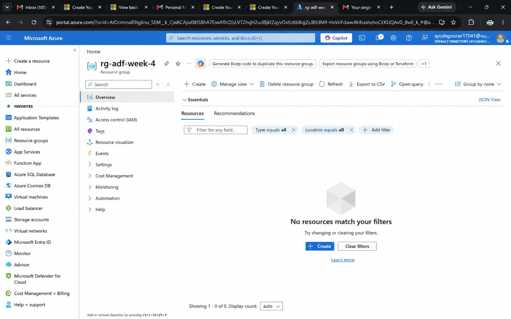
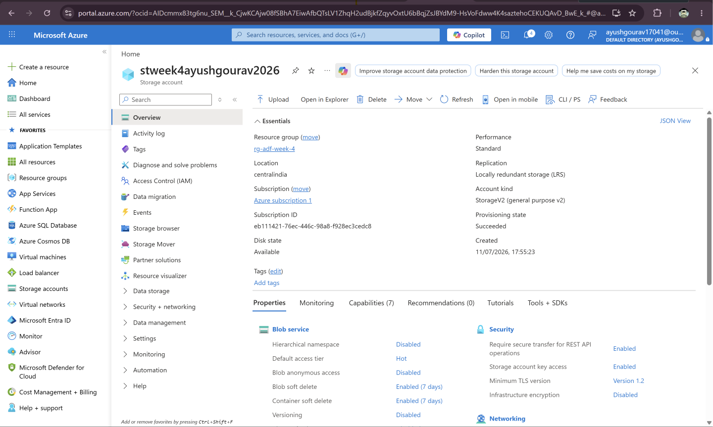
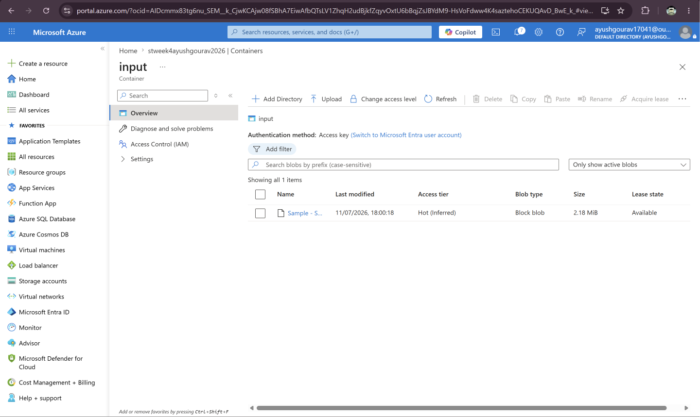
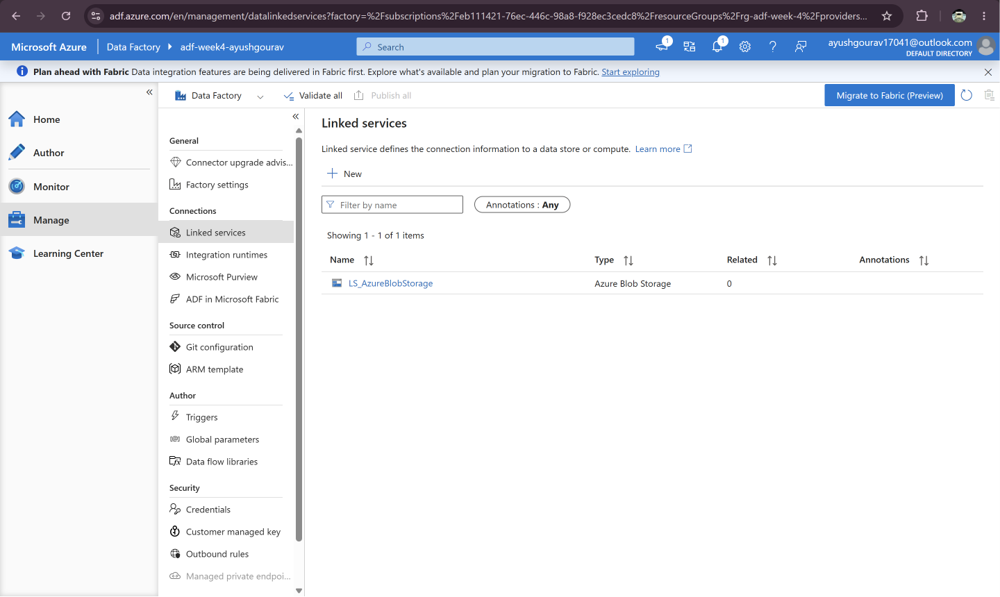
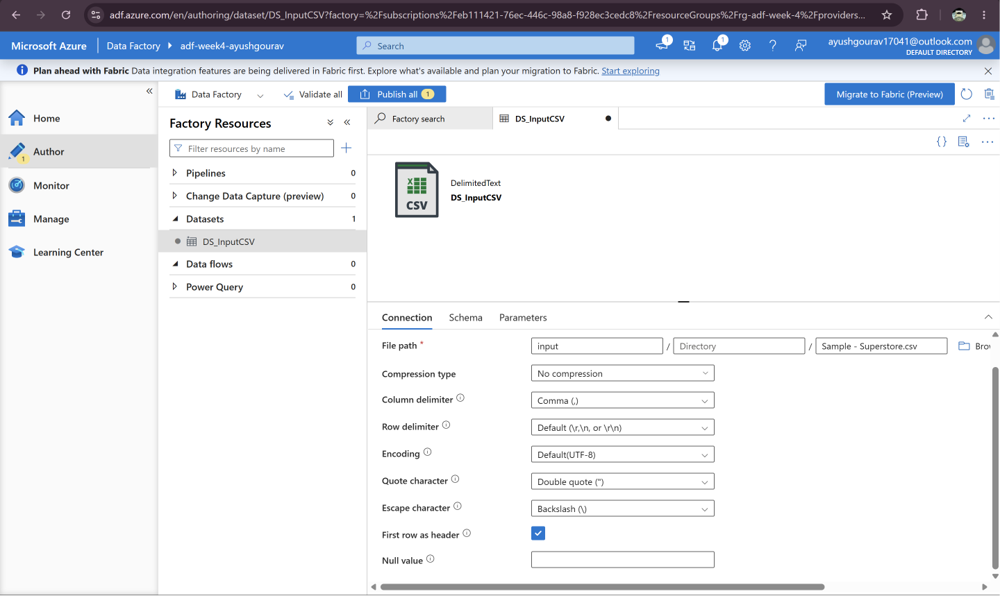
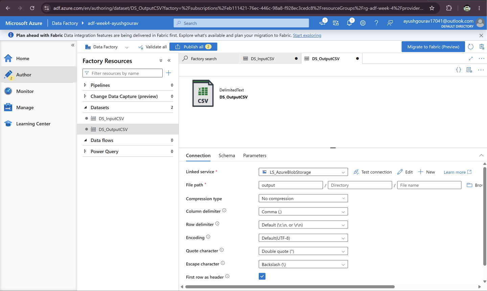
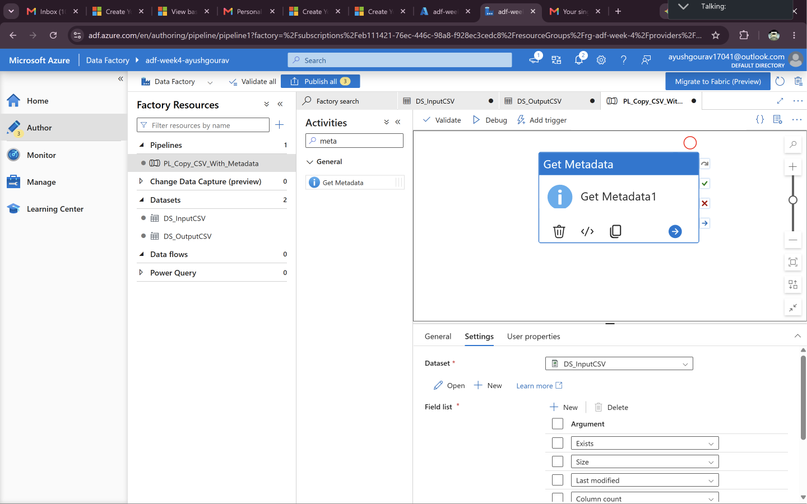
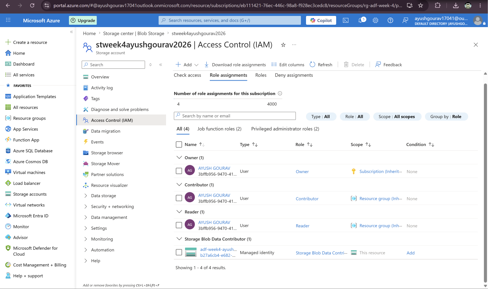
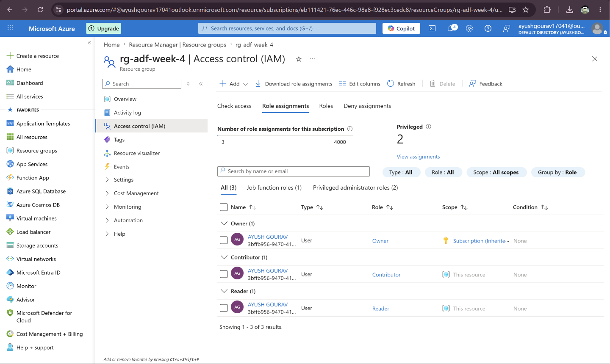

# Azure Data Factory (ADF) – Week 4 Assignment

## Project Overview

This project demonstrates the fundamentals of Microsoft Azure Cloud and Azure Data Factory (ADF) by building a simple ETL pipeline. The pipeline reads a CSV file from Azure Blob Storage, retrieves its metadata, and copies it to another Blob Storage container.

---

## Azure Services Used

- Azure Resource Group
- Azure Storage Account
- Azure Blob Storage
- Azure Data Factory (ADF)
- Azure Identity and Access Management (IAM/RBAC)

---

## Dataset

**Sample - Superstore.csv**

---

# Tasks Completed

## Task 1: Resource Group Creation

Created an Azure Resource Group to organize and manage all resources used in this project.

**Resource Group:** `rg-adf-week4`

### Screenshot

---

## Task 2: Azure Storage Configuration

Created an Azure Storage Account and configured two Blob Storage containers:

- **input**
- **output**

Uploaded the **Sample - Superstore.csv** file to the **input** container.

### Screenshots

---

## Task 3: Azure Data Factory Configuration

Created an Azure Data Factory instance and configured the required components:

- Linked Service: `LS_AzureBlobStorage`
- Source Dataset: `DS_InputCSV`
- Destination Dataset: `DS_OutputCSV`

Configured a **Get Metadata** activity to validate the source file before copying.

### Screenshots

---

## Task 4: Pipeline Development

Developed an Azure Data Factory pipeline containing:

- Get Metadata
- Copy Data

The pipeline validates the source file and copies it from the **input** container to the **output** container.

### Screenshot

---

## Task 5: Pipeline Execution

Executed the pipeline successfully using **Debug**.

The pipeline completed successfully and generated the output CSV in the destination Blob container.

### Screenshots

---

## Task 6: IAM Role Assignments

Configured Azure RBAC permissions for the Azure Data Factory Managed Identity.

Assigned roles:

- Reader
- Contributor
- Storage Blob Data Contributor

### Screenshots

---

# Mini Project Summary

This project demonstrates a Azure Data Factory ETL pipeline.

### Workflow

**Source**

- Sample - Superstore.csv
- Azure Blob Storage (**input** container)

**Processing**

- Get Metadata Activity
- Copy Data Activity

**Destination**

- Azure Blob Storage (**output** container)

**Status**

✅ Pipeline executed successfully.

---

# Issue Faced

During execution, the CSV file contained commas inside quoted text, which caused parsing issues.

The issue was resolved by configuring:

- Quote Character: `"`
- Escape Character: `\`
- Column Delimiter: `,`
- First Row as Header: Enabled

---

# Conclusion

The Azure Data Factory pipeline was successfully designed, configured, and executed.

This assignment demonstrates:

- Azure Resource Group creation
- Azure Storage Account configuration
- Blob Storage management
- Linked Service configuration
- Dataset creation
- Metadata validation
- Copy Data activity
- Pipeline execution
- IAM role assignment

The project provided hands-on experience with Azure Data Factory and fundamental cloud-based data engineering concepts.

---

# Author

**Ayush Gourav**

- B.Tech in Computer Science & Engineering (2023–2027)
- ITER, Siksha 'O' Anusandhan (Deemed to be University)
- Data Engineering Intern
- Celebal Technologies Summer Internship 2026